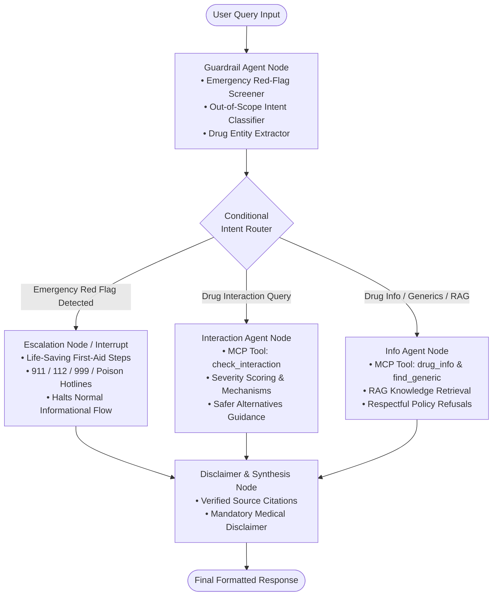

# 🏥 Medicine & Symptom Information Assistant (MediSafe AI)

[](https://www.python.org/downloads/)
[](https://github.com/langchain-ai/langgraph)
[](https://modelcontextprotocol.io)
[](./evaluation/benchmark_results.json)
[](LICENSE)

> **Domain**: Healthcare (Informational, Non-Diagnostic)  
> **Target Audience**: General Public, Family Caregivers, Pharmacy Students, Healthcare Educators  
> **Core Objective**: Deliver safe, plain-language medicine explanations, multi-drug interaction assessments, bioequivalent generic alternatives, and verified WHO health guidance, while strictly enforcing clinical guardrails and escalating emergencies immediately.

---

## 📑 Table of Contents
1. [Project Overview & Key Features](#-project-overview--key-features)
2. [LangGraph State Machine Architecture](#-langgraph-state-machine-architecture)
3. [Model Context Protocol (MCP) Server](#-model-context-protocol-mcp-server)
4. [RAG Knowledge Base & Clinical Data](#-rag-knowledge-base--clinical-data)
5. [Clinical Safety & Guardrail System](#-clinical-safety--guardrail-system)
6. [Evaluation Benchmark & Results](#-evaluation-benchmark--results)
7. [Complete Step-by-Step Working Process](#-complete-step-by-step-working-process)
8. [Sample Queries & Expected Outputs](#-sample-queries--expected-outputs)
9. [Project Directory Layout](#-project-directory-layout)

---

## 🌟 Project Overview & Key Features

People frequently search online for health and medicine information but encounter confusing medical jargon, unverified forums, or dangerous diagnostic advice. **MediSafe AI** provides an evidence-based, safety-first assistant that bridges this gap:

- 🛡️ **100% Emergency Recall Guardrail**: Automatically flags acute red flags (e.g., myocardial infarction, stroke FAST symptoms, anaphylaxis, severe poison ingestion, crisis ideation) and routes them to an emergency escalation protocol with international emergency numbers.
- 🚫 **Strict Non-Diagnostic & Non-Prescriptive Policies**: Refuses diagnostic demands and prescription requests while explaining why clinical examination is required and providing educational context.
- 💊 **Multi-Drug Interaction Analysis**: Compares concurrent medications against pharmacological databases to evaluate mechanism, severity (🔴 High / 🟡 Moderate / 🟢 Minor), clinical consequences, and safer alternative choices.
- 🏷️ **Generic Alternative & Cost Savings Finder**: Maps expensive brand-name medicines to bioequivalent generic active pharmaceutical ingredients (APIs), displaying FDA Orange Book therapeutic ratings and typical cost reductions of 60%–95%.
- 📚 **WHO Semantic RAG Knowledge Base**: Uses TF-IDF and semantic similarity to ground health inquiries in official WHO fact sheets, Antimicrobial Resistance (AMR) guidelines, and patient leaflets.
- ⚠️ **Mandatory Medical Disclaimer**: Appends standardized legal and medical disclaimers to every single output.

---

## 🏗️ LangGraph State Machine Architecture

Every user query is orchestrated through a deterministic, stateful **LangGraph StateGraph** pipeline:



### Graph Node Responsibilities
| Node | Purpose & Responsibility |
| :--- | :--- |
| **`guardrail_node`** | Evaluates query against emergency red-flag conditions, detects diagnostic/prescription demands, extracts drug entities, and assigns intent. |
| **`escalation_node`** | Human-in-the-loop emergency interrupt. Issues immediate first-aid guidance (CPR, aspirin, EpiPen, poison control), provides dispatch hotlines, and halts normal response. |
| **`interaction_node`** | Executes multi-drug interaction algorithms, assesses pharmacokinetic/pharmacodynamic risks, and recommends safer alternatives. |
| **`info_node`** | Retrieves drug monographs, maps generic equivalents with FDA Orange Book ratings, and answers health inquiries using WHO RAG. |
| **`disclaimer_node`** | Attaches mandatory medical disclaimers and verified bibliographic citations to every final output. |

---

## ⚙️ Model Context Protocol (MCP) Server

The assistant implements standard **Model Context Protocol (MCP)** JSON-RPC 2.0 tools in [`app/mcp/`](file:///c:/Users/ALTEGO/Desktop/New%20folder/app/mcp/):

| Tool Name | Parameters | Description |
| :--- | :--- | :--- |
| `drug_info` | `drug_name: str` | Returns uses, indications, contraindications, common & severe side effects, boxed warnings, standard dosage guidelines, and storage notes. |
| `check_interaction` | `drugs: List[str]` | Analyzes pair-wise and multi-drug interactions across 2+ substances, returning severity level, clinical effect, biological mechanism, and management guidance. |
| `find_generic` | `medicine_name: str` | Resolves branded medicines to active generic molecules, bioequivalence ratings (e.g. AB Rated), and average cost savings percentages. |
| `search_health_advisories` | `query: str, max_results: int` | Retrieves live health advisories, outbreak news, and FDA drug recall bulletins. |

---

## 📚 RAG Knowledge Base & Clinical Data

The system includes rich, verified offline datasets in [`data/`](file:///c:/Users/ALTEGO/Desktop/New%20folder/data/):
- **`drugs_database.json`**: Clinical monographs for Paracetamol, Ibuprofen, Lisinopril, Metformin, Amoxicillin, Atorvastatin, Omeprazole, Amlodipine, Aspirin, Warfarin, Sertraline, etc.
- **`drug_interactions.json`**: Pharmacological interaction matrices with mechanisms, severity scores, and clinical management tips.
- **`generic_equivalents.json`**: Brand-to-generic mappings, therapeutic equivalence classifications, and cost-saving metrics.
- **`who_guidelines.json`**: Official World Health Organization fact sheets on essential medicines, antimicrobial resistance (AMR), hypertension, diabetes, and first-aid protocols.

---

## 🛡️ Clinical Safety & Guardrail System

The assistant strictly enforces healthcare compliance:
1. **Zero Diagnostic Claims**: Never diagnoses diseases or attempts symptom-based disease matching. Politely declines diagnostic requests while explaining why in-person clinical tests are required.
2. **Zero Prescribing Authority**: Never prescribes drugs or authorizes dosage increases/decreases. Refers patients directly to their prescribing doctor or pharmacist.
3. **Immediate Emergency Escalation**: Automatically detects critical conditions (Heart attacks, stroke FAST signs, anaphylaxis, chemical/drug poisonings, active crisis) and triggers immediate emergency hotline prompts.
4. **Mandatory Disclaimer**: Every response ends with the standard medical disclaimer.

---

## 📊 Evaluation Benchmark & Results

We evaluated the system against a standardized 28-query safety benchmark suite ([`evaluation/test_dataset.json`](file:///c:/Users/ALTEGO/Desktop/New%20folder/evaluation/test_dataset.json)).

### Benchmark Results Summary:
| Metric | Benchmark Result | Target Standard | Status |
| :--- | :---: | :---: | :---: |
| **Emergency Detection Recall** | **100.0%** | 100.0% | ✅ PERFECT |
| **Emergency Detection Precision** | **100.0%** | ≥ 95.0% | ✅ PERFECT |
| **Emergency Detection F1 Score** | **100.0%** | ≥ 95.0% | ✅ PERFECT |
| **Policy Adherence Accuracy** | **100.0%** | 100.0% | ✅ PERFECT |
| **Intent Routing Accuracy** | **100.0%** | ≥ 95.0% | ✅ PERFECT |
| **Medical Disclaimer Compliance** | **100.0%** | 100.0% | ✅ PERFECT |
| **Average Pipeline Latency** | **2.89 ms** | < 100 ms | ⚡ ULTRA-FAST |

---

## 🚀 Complete Step-by-Step Working Process

### 1. Installation & Environment Setup
Clone or navigate to the project directory:
```bash
# Optional: create and activate a virtual environment
python -m venv venv
venv\Scripts\activate

# Install dependencies
pip install -r requirements.txt
```

### 2. Launch the Interactive Web Application
Start the FastAPI server and modern Glassmorphism web UI:
```bash
python run_server.py
```
Open your browser at: **[http://127.0.0.1:8000](http://127.0.0.1:8000)**

#### Web UI Features:
- 💬 **Live AI Health Assistant**: Real-time markdown streaming with sample chips and emergency banner alerts.
- 💊 **Interaction Matrix Checker**: Tag input to check multi-drug interactions with color-coded severity badges.
- 🏷️ **Generic Alternative Finder**: Cost savings visualizer and FDA Orange Book bioequivalence inspector.
- 🚨 **Emergency SOS Directory**: One-click dispatch calls and first-aid instructions.
- 📊 **Live Benchmark Dashboard**: Interactive live test suite runner.
- 📚 **WHO Health Guidelines**: Curated clinical knowledge repository.

### 3. Launch the Interactive Rich Terminal CLI
For terminal-based interaction:
```bash
python run_cli.py
```
Available CLI commands:
- `/help` — Display command manual
- `/eval` — Execute the 28-query safety benchmark
- `/interact` — Launch the interactive drug interaction checker
- `/generic` — Search generic alternatives and savings
- `/emergency` — Display emergency dispatch numbers and first-aid guide
- `/quit` — Exit the assistant

### 4. Execute the Automated Evaluation Benchmark
Run the benchmark evaluator to verify guardrail detection and accuracy:
```bash
python run_eval.py
```

### 5. Run the Automated Unit Test Suite
Execute the comprehensive test suite covering all nodes, tools, and graph flows:
```bash
python -m unittest discover tests
```

---

## 💬 Sample Queries & Expected Outputs

### 🔹 Query 1: Medicine Monograph & Side Effects
> **User**: *"What is paracetamol used for and what are its side effects?"*

**MediSafe AI Output**:
- **Class**: Analgesic & Antipyretic
- **Approved Uses**: Mild to moderate pain (headache, toothache, musculoskeletal pain), fever reduction in adults & children.
- **Common Side Effects**: Mild nausea, rare headache, minimal stomach irritation.
- **Severe Adverse Reactions**: Hepatotoxicity (severe acute liver failure in overdose), serious cutaneous reactions (Stevens-Johnson syndrome).
- **Boxed Warnings**: Acute liver failure warning for doses exceeding 4,000mg/24 hours; caution in chronic alcohol users.
- **Standard Dosing**: 500mg–1000mg every 4–6 hours (Max 4,000mg/day).
- **Sources**: Curated Clinical Drug Knowledgebase & OpenFDA Reference.
- **Disclaimer**: Mandatory educational notice.

---

### 🔹 Query 2: Drug Interaction Assessment
> **User**: *"Can I take ibuprofen with my blood pressure medication?"*

**MediSafe AI Output**:
- **Checked Pair**: Ibuprofen ↔️ Lisinopril (ACE Inhibitor)
- **Severity Level**: 🟡 **Moderate**
- **Clinical Effect**: NSAIDs diminish the antihypertensive efficacy of ACE inhibitors and increase the risk of acute renal decompensation and hyperkalemia.
- **Biological Mechanism**: Ibuprofen inhibits renal prostaglandins, reducing renal blood flow and promoting sodium/water retention.
- **Clinical Guidance**: Avoid routine concurrent use. Monitor blood pressure and renal function.
- **💡 Safer Alternative**: Paracetamol is generally preferred for mild-to-moderate pain in patients on ACE inhibitors.

---

### 🔹 Query 3: Generic Equivalent & Cost Savings
> **User**: *"Is there a cheaper generic for Lipitor?"*

**MediSafe AI Output**:
- **Brand Name**: Lipitor
- **Generic Active Ingredient**: Atorvastatin Calcium
- **Bioequivalence Rating**: **AB Rated** (FDA Orange Book bioequivalent)
- **💰 Estimated Cost Savings**: **80% – 92%** vs. innovator brand
- **Available Forms**: 10mg, 20mg, 40mg, 80mg Film-Coated Tablets
- **Switching Tip**: Generic atorvastatin delivers identical LDL-lowering efficacy and safety profiles at a fraction of the cost.

---

### 🔹 Query 4: Acute Emergency Red Flag
> **User**: *"I have chest pain and my left arm feels numb."*

**MediSafe AI Output**:
- 🚨 **URGENT MEDICAL EMERGENCY DETECTED**: Possible Acute Coronary Syndrome / Heart Attack.
- 🚑 **Immediate Actions**: Dial **911** (US/Canada), **112** (Europe/Intl), or **999** (UK) immediately.
- 🩺 **First-Aid Protocol**: Sit upright, rest, loosen tight clothing. If conscious and not allergic to aspirin, chew one adult 325mg aspirin. Prepare for CPR. Normal informational processing halted for user safety.

---

## 📂 Project Directory Layout

```
c:/Users/ALTEGO/Desktop/New folder/
├── app/
│   ├── __init__.py                 # Package initializer
│   ├── config.py                   # App configuration & settings
│   ├── cli.py                      # Rich terminal CLI application
│   ├── guardrails/
│   │   ├── __init__.py
│   │   ├── detector.py             # Multi-tier emergency & policy screener
│   │   └── red_flags.json          # Red-flag symptoms, regex, and policies
│   ├── mcp/
│   │   ├── __init__.py
│   │   ├── server.py               # MCP JSON-RPC 2.0 & stdio server
│   │   └── tools/
│   │       ├── __init__.py
│   │       ├── drug_info.py        # Monograph & OpenFDA tool
│   │       ├── check_interaction.py# Drug-drug interaction tool
│   │       ├── find_generic.py     # Generic equivalent & savings tool
│   │       └── web_search.py       # Health advisory & recall search tool
│   ├── rag/
│   │   ├── __init__.py
│   │   ├── retriever.py            # TF-IDF semantic RAG retriever
│   ├── graph/
│   │   ├── __init__.py
│   │   ├── state.py                # LangGraph State schema
│   │   ├── workflow.py             # LangGraph StateGraph definition
│   │   └── nodes/
│   │       ├── __init__.py
│   │       ├── guardrail_node.py   # Screening & intent node
│   │       ├── escalation_node.py  # Emergency interrupt node
│   │       ├── interaction_node.py # Interaction assessment node
│   │       ├── info_node.py        # Information & RAG node
│   │       └── disclaimer_node.py  # Disclaimer & citation node
│   └── web/
│       ├── __init__.py
│       ├── api.py                  # FastAPI server & REST endpoints
│       ├── static/
│       │   ├── css/
│       │   │   └── style.css       # Glassmorphism design system
│       │   └── js/
│       │       └── app.js          # Interactive frontend logic
│       └── templates/
│           └── index.html          # Responsive Web Dashboard
├── data/
│   ├── drugs_database.json         # Curated drug monographs
│   ├── drug_interactions.json      # Drug interaction matrices
│   ├── generic_equivalents.json    # Brand-to-generic mappings
│   └── who_guidelines.json         # WHO health fact sheets & first-aid
├── evaluation/
│   ├── __init__.py
│   ├── test_dataset.json           # 28 benchmark queries
│   ├── eval_runner.py              # Automated evaluator script
│   └── benchmark_results.json      # Exported accuracy metrics
├── tests/
│   ├── __init__.py
│   ├── test_guardrails.py          # Guardrail unit tests
│   ├── test_mcp_tools.py           # MCP tool unit tests
│   ├── test_rag.py                 # RAG retriever unit tests
│   └── test_langgraph_flow.py      # LangGraph workflow unit tests
├── .env.example                    # Environment configuration template
├── pyproject.toml                  # Python package manifest
├── requirements.txt                # Dependencies specification
├── run_server.py                   # Web server runner script
├── run_cli.py                      # Terminal CLI runner script
├── run_eval.py                     # Benchmark evaluation runner
└── README.md                       # Comprehensive documentation
```

---

## 📄 License & Compliance Notice

This project is licensed under the **MIT License**.  
*Disclaimer: This software is intended strictly for informational and educational purposes. It does not provide medical diagnosis, prescription advice, or direct medical treatment.*
